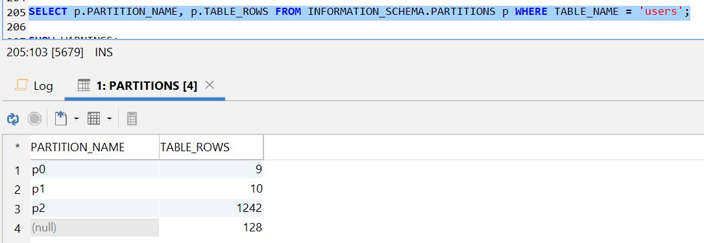

<h1 align="center">ДЗ 11</h1>
<h1 align="center">MySQL PARTITION (RANGE)</h1>

---
Партиционирование (partitioning) — это разбиение больших таблиц на логические части по выбранным критериям.
Разбиение таблицы на разделы очень полезно, если таблица содержит большое количество данных. Разбиение ускорит выборку и запись в таблицу.
На нижнем уровне для myISAM таблиц, это физически разные файлы, по 3 на каждую партицию (описание таблицы, файл индексов, файл данных). Для innoDB таблиц в конфигурации по умолчанию – разные пространства таблиц в файлах innoDB (не забываем, что innoDB позволяет настраивать индивидуальные хранилища на уровне баз данных или даже конкретных таблиц).
Вот некоторые преимущества партиционирования:

+ Можно сохранять большее количество данных в одной таблице, чем может быть записано на одиночном диске или файловой системе.
+ Данные, которые теряют полноценность, часто легко могут быть удалены из таблицы, удаляя раздел, содержащий только эти данные. Наоборот, процесс добавления новых данных в некоторых случаях может быть значительно облегчен, добавляя новый раздел специально для этих данных.
+ Некоторые запросы могут быть значительно оптимизированы в том, что данные, удовлетворяющие предложению WHERE могут быть сохранены только на одном или большем количестве разделов, таким образом исключая любые остающиеся разделы из поиска. Поскольку разделы могут быть изменены после того, как разбитая на разделы таблица была создана, Вы можете реорганизовать данные, чтобы расширить частые запросы, которые, возможно, были медленными, когда схема выделения разделов была сначала установлена. Эта возможность, иногда упоминаемая как сокращение раздела (partition pruning), была выполнена в MySQL 5.1.6.
+ Запросы, включающие составные функции типа SUM() и COUNT(), легко могут быть распараллелены. Простым примером такого запроса мог бы быть SELECT salesperson_id, COUNT(orders) as order_total FROM sales GROUP BY salesperson_id;. Запрос может быть выполнен одновременно на каждом разделе, и результат получен просто суммируя результаты, полученные для всех разделов.
+ Достижение большей производительности запроса благодаря разбросу данных по разным дискам.

Типы разбиения:
+ RANGE partitioning: назначает строки разделам, основанным на значениях столбца, попадающих внутрь заданного диапазона.
+ LIST partitioning: подобно выделению разделов диапазоном, за исключением того, что раздел выбран основанным на столбцах, соответствующих одному из набора дискретных значений.
+ HASH partitioning: раздел выбран основанным на значении, возвращенном определяемым пользователем выражением, которое функционирует на значениях столбца в строках, которые будут вставлены в таблицу. Функция может состоять из любого выражения, допустимого в MySQL, которое выдает не отрицательное целочисленное значение.
+ KEY partitioning: подобно выделению разделов hash, за исключением того, что обеспечены только один или большее количество столбцов, которые будут оценены, и сервер MySQL обеспечивает собственную хэш-функцию. Эти столбцы могут содержать не целочисленные значения, так как хэш-функция, обеспеченная MySQL, гарантирует целочисленный результат, независимо от типа данных столбца.


### Create table ###
```sql
--Создал таблицу для теста
CREATE TABLE users (
  id MEDIUMINT(8) UNSIGNED NOT NULL AUTO_INCREMENT,
  name VARCHAR(200) NOT NULL,
  surname VARCHAR(200) NOT NULL,
  age INT NOT NULL,
  PRIMARY KEY (id)
) ENGINE=INNODB;
```

### Create procedure (заполняем таблицу) ###
```sql
-- numlines - кол-во строк, tableName - имя таблицы в которую хотим добавить эти строки
DELIMITER //
CREATE PROCEDURE filltable (IN numlines INT, IN tableName VARCHAR(64))
BEGIN
  DECLARE i INT DEFAULT 0;
  DECLARE a,b VARCHAR(11);
    while (i<numlines) do
      SELECT CHAR(65+rand()*26,65+rand()*26,65+rand()*26,65+rand()*26 USING utf8)INTO a;
      SELECT CHAR(65+rand()*26,65+rand()*26,65+rand()*26,65+rand()*26 USING utf8)INTO b;
      SET @t1 =CONCAT('INSERT INTO ',tableName,' (name, surname, age) VALUES (\'',a,''',', '\'',b,'\', rand()*100);');
      PREPARE stmt3 FROM @t1;
      EXECUTE stmt3;
      DEALLOCATE PREPARE stmt3;
      set i=i+1;
    end while;
END
//
--Заполняем таблицу
CALL filltable (1000, 'users');
```
### Применияем партицирование ###

``у MySQL достаточно много ограничений на секционирование таблиц, советую почитать мануал в этой части внимательно, есть сильно неочевидные вещи.
То ограничение, которое встретилось вам, как правильно указал netwind, звучит примерно так: каждый уникальный ключ (включая PK, который является UK NOT NULL) должен содержать все колонки, используемые в выражении, по которому идет секционирование. Вызвано это тем, что в MySQL отсутствуют глобальные индексы, так как поддержание подобных индексов достаточно дорогая операция.
Иными словами, имея PK id и секционирование по полю ddate, MySQLю бы пришлось каким-то образом гарантировать, что id уникален во всех партициях сразу. Для этого нужен индекс, проходящий сквозь все секции. MySQL такого не умеет. А вот если PKем станет пара id, ddate, то достаточно, чтобы внутри каждой секции эти значения были уникальными. Так как ddate в разных секциях будет разный, то это автоматически гарантирует уникальность пары id, ddate на всей таблице.``

```sql
ALTER TABLE users PARTITION BY RANGE (id) (
 PARTITION p0 VALUES LESS THAN (10),
 PARTITION p1 VALUES LESS THAN (20),
 PARTITION p2 VALUES LESS THAN (MAXVALUE)
);

SELECT p.PARTITION_NAME, p.TABLE_ROWS FROM INFORMATION_SCHEMA.PARTITIONS p WHERE TABLE_NAME = 'users';
```





| Database   | ver    |
| -----      | ---    |
| MySQL      | 8.0.15 |
